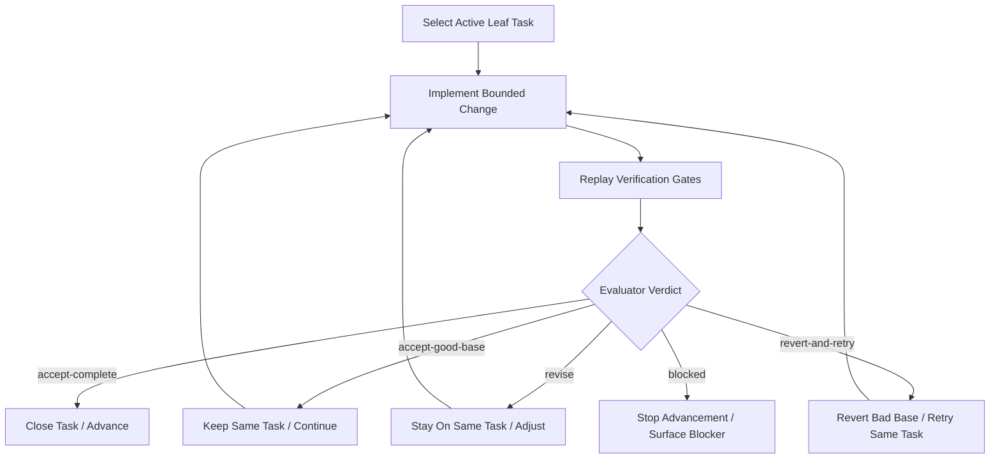

# Spec-Constrained Agent Loop

This document formalizes the two-agent process that helped unblock the WebGPU recovery work.

It is intentionally broader than the current `RECOVER-*` loop. The WebGPU prompts remain the concrete operating procedure. This document explains the underlying method so it can be reused elsewhere.

`// [LAW:one-source-of-truth] The process exists to keep one authoritative task boundary and one authoritative handoff artifact at all times.`
`// [LAW:verifiable-goals] The process is useful only when progress and correctness can be judged by machine-verifiable gates.`

## What Problem This Solves

This loop is for cases where:

1. the system is already unstable or partially broken
2. the target architecture is known well enough to constrain work, but not well enough to implement in one clean pass
3. naive "just keep coding" behavior causes scope drift, premature downstream work, or fake progress
4. a single agent tends to rationalize bad intermediate states instead of correcting course

In that situation, the process works by replacing vague momentum with:

- one active work boundary
- one explicit evaluator
- one canonical handoff note
- one set of replayable gates

## Why It Worked

The useful part was not "two agents" by itself. The useful part was the structure imposed on them.

The loop helped because it forced five things that were previously missing:

1. **Exclusive ownership of the current problem**
   - only one active leaf task at a time
   - no opportunistic advancement to "the next thing"

2. **Independent judgment**
   - the implementer no longer self-certified correctness
   - the evaluator replayed evidence instead of trusting the report

3. **Persistent external memory**
   - the loop stopped depending on agent memory
   - repo state, ticket state, and a note file became the working memory

4. **Preemption**
   - if an earlier prerequisite boundary was broken again, the loop snapped back to it
   - downstream work stopped accumulating on top of wrong assumptions

5. **Baseline preservation**
   - "it was already broken" stopped being a valid excuse
   - once a visible baseline existed, later work had to preserve it

`// [LAW:dataflow-not-control-flow] The process makes progress depend on explicit state transitions and artifacts rather than ad hoc conversational control flow.`

## Core Model

The loop has two roles:

- **Implementer**
  - makes bounded progress on one task
  - proves local evidence
  - never declares the system done on its own

- **Evaluator**
  - judges the current repo state against the active task
  - decides whether to accept, revise, revert, or block
  - prepares the exact next step

The loop has three persistent artifacts:

- **Task tracker**
  - source of work ordering and ownership
- **Git history / repo state**
  - source of actual implementation state
- **Evaluator note**
  - source of run-to-run steering

## Canonical Invariants

These are the rules that make the loop valuable rather than noisy:

1. **One active task**
   - exactly one leaf task owns current work
   - epics and milestones are never implementation targets

2. **Evaluator lock**
   - the implementer cannot advance without evaluator authorization
   - the evaluator cannot widen scope beyond the active task

3. **Earlier prerequisite preemption**
   - if an earlier dependency becomes false again, it immediately regains ownership

4. **Clean-tree closeout**
   - every run ends from a clean worktree
   - no hidden local state is allowed to become loop memory

5. **Replayable verification**
   - every accepted verdict must be reproducible locally

6. **Baseline preservation**
   - once a meaningful runtime baseline exists, later work must preserve it unless the active task explicitly owns a temporary regression

`// [LAW:single-enforcer] The evaluator is the single acceptance boundary; the implementer is not allowed to self-accept.`

## Process State Machine

At a high level:

The important detail is that **advance** is not a side effect of coding. It is an explicit evaluator verdict.

## The Gates

Every run should be explainable as gates, not vibes.

Recommended gate set:

1. **Source alignment**
   - the task, cited docs, and current implementation target agree

2. **Ownership alignment**
   - the change moves ownership in the intended direction
   - no dual authority or fallback path is introduced

3. **Live-path alignment**
   - the ticket changes the real path, not only helper code or scaffolding

4. **Static verification**
   - typecheck, lint, compile, or equivalent

5. **Behavior verification**
   - targeted tests prove the intended behavior

6. **Runtime verification**
   - when relevant, actual runtime/readback/screenshot evidence

7. **Baseline verification**
   - previously accepted visible behavior still works

8. **Closeout verification**
   - note written, tracker updated, clean tree

If a gate fails because the chosen implementation was bad, retry is allowed inside the same task.

If a gate fails because the scope is wrong, ownership is wrong, or a prerequisite is missing, the loop should not improvise. It should redirect or block.

## Why The Evaluator Note Matters

The evaluator note is the simplest possible form of explicit external state.

It should answer:

- what task is active
- what commit was evaluated
- what verdict was reached
- what the next run is allowed to do
- what it should do
- what it must avoid
- what gates passed or failed

That note is not optional commentary. It is the handoff contract.

`// [LAW:one-source-of-truth] If both the tracker and the note can steer the next run, one must win. In this process, the active task plus evaluator note win.`

## When To Use This Process

This process is a good fit when:

- the work is architectural and multi-step
- partial correctness is dangerous
- upstream and downstream stages can invalidate each other
- the system needs gradual repair instead of greenfield implementation

This process is a poor fit when:

- the task is tiny and local
- there is no meaningful runtime baseline
- correctness can be established in one straightforward pass
- the evaluator would have nothing independent to add

## Failure Modes It Prevents

This loop is specifically meant to prevent:

- **scope drift**
  - agent moves to ticket N+1 because ticket N "seems good enough"

- **false completion**
  - tests pass but the live path is still wrong

- **accumulated architectural debt**
  - downstream changes keep landing on top of a bad upstream boundary

- **hidden local state**
  - the next run depends on unstaged or unexplained repo state

- **prompt-only memory**
  - the process breaks as soon as context is lost

## Recommended Next Formalizations

If we want to keep using this pattern, the best follow-up improvements are:

1. **Extract a generic loop template**
   - separate the generic process from WebGPU-specific tickets and docs

2. **Make the evaluator note schema machine-readable**
   - JSON or TOML would be easier to validate than free-form markdown

3. **Define baseline harnesses explicitly**
   - screenshot, readback, and runtime probes should be standardized per stream

4. **Formalize preemption rules**
   - make "earliest violated prerequisite wins" a first-class rule in tracker metadata

5. **Separate bootstrap acceptance from production acceptance**
   - some tickets prove a bootstrap seam, not final architecture
   - the verdict model should distinguish those cleanly

6. **Migrate tracker commands from `lit` to `lnks`**
   - the toolchain is already signaling that transition

## Building Proof While The Loop Runs

The hardest question is usually:

> How do we create proof before the proof exists?

The answer is: proof-building is part of the work. It is not a postscript.

For any ticket, the loop should first ask:

1. what exact behavior claim is this ticket making?
2. what observable consequence would necessarily follow if that claim were true?
3. what is the cheapest deterministic boundary where that consequence can be checked?

If no such boundary exists yet, the first deliverable of the ticket is to create the smallest proof seam needed to make later work safe.

That means the loop may legitimately spend a run on:

- adding readback
- exposing telemetry
- freezing a canonical fixture
- adding a runtime probe
- adding a contract test around an ownership boundary

`// [LAW:verifiable-goals] If the system cannot yet prove the ticket's success condition, creating the proof seam is part of implementing the ticket, not auxiliary work.`

### Proof Should Be Grown From Primitive Truths

When starting from almost nothing, the loop should not wait for a perfect end-to-end oracle.

Instead, build proofs in layers:

1. boot succeeds
2. no fatal logs / no GPU loss / no bootstrap failure
3. canonical fixture compiles
4. indirect args or readback become non-zero
5. expected shape class / route / sink record appears
6. visible output baseline remains stable
7. optional screenshot or image diff once the earlier layers are trustworthy

The loop should start with the strongest primitive truth it can obtain cheaply, then accumulate stronger proofs on top.

### Changing Behavior Requires Overlapping Proofs

Behavior-changing refactors should not discard old proof and hope the new proof is enough.

During migration, the acceptance shape is usually:

- the old accepted baseline still works
- and the new ownership or boundary claim is now provably true

That overlap is how the loop changes behavior without going blind.

Examples:

- old baseline: canonical patch still renders
- new proof: CPU-packed indirect fields remain zero while GPU draw-prep produces non-zero indirect args

Both matter during transition.

### Proofs Are Not Whatever The Implementer Can Measure

The implementer should not be free to invent an arbitrary check and call it proof.

The evaluator should reject a proposed proof if any of these are true:

1. it only proves implementation structure
2. it can pass while the intended behavior is still wrong
3. it does not distinguish old ownership from new ownership
4. it is not derived from the active ticket/spec claim
5. it cannot be replayed locally

The key question is:

> Could this check still pass if the ticket were actually wrong?

If yes, it is not sufficient proof.

### Proof Quality Rubric

Classify every check as one of these:

1. **Acceptance proof**
   - required to move on
2. **Supporting signal**
   - increases confidence but is not enough on its own
3. **Diagnostic tool**
   - useful for debugging but does not prove correctness

The loop should advance only on acceptance proof, not merely on supporting signals.

### Practical Rule

A proof is acceptable only if all are true:

1. it is derived from the ticket/spec claim
2. it would fail if the old wrong behavior were still active
3. it is replayable by the evaluator
4. it is stronger than structural coincidence
5. it becomes part of the baseline for later tickets when appropriate

If proof quality is uncertain, the loop should slow down and improve the proof instead of continuing the refactor.

`// [LAW:single-enforcer] The evaluator is the single authority that decides whether a proposed proof is strong enough to unlock advancement.`

## Recommended Immediate Follow-Up For This Repo

The process itself is now proven enough to document, but the implementation around it can be improved:

1. move the reusable logic out of the WebGPU-specific prompts
2. add one concise "operator guide" for running implementer/evaluator loops on any bounded backlog
3. define one canonical runtime-baseline harness for renderer work
4. decide whether the process should remain dual-agent only, or whether a single-agent "self-evaluate but do not advance" variant is also useful

That would preserve the useful discipline without tying the pattern forever to `RECOVER-*`.
