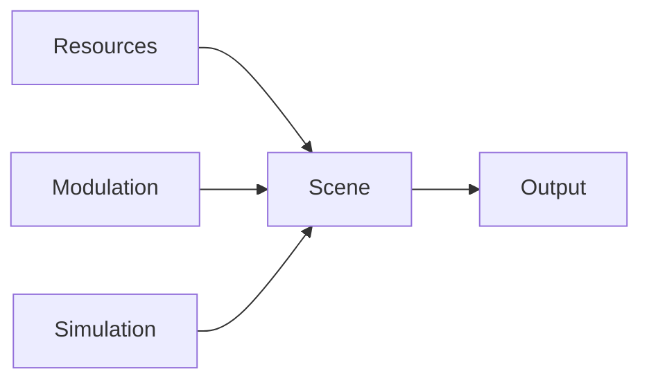

# Canonical Authoring UI Design

This document defines the appropriate user interface for constructing animations in the canonical authoring model.

It is intentionally designed for the layered authoring architecture:

- resources
- modulation
- simulation
- scene assembly
- outputs

It is not a proposal for one giant undifferentiated node editor.

// [LAW:one-source-of-truth] The UI must reflect the actual authoring architecture. It must not present one generic graph surface that hides the distinction between resources, modulation, simulation, scene assembly, and outputs.
// [LAW:locality-or-seam] Each user task should happen in the appropriate UI seam so adding a new feature does not force unrelated parts of the editor to change.

## 1. Problem

The new authoring model has clear layers, but the current mental default for graph tools is still:

- one infinite node canvas
- one block palette
- one connection model for everything

That UI shape is wrong for this architecture because it encourages:

- resource definitions as loose graph fragments
- simulation definitions as ad hoc wiring
- scene assembly as render-sink plumbing
- graph spaghetti

The UI should make the semantic layers visible and intentional.

## 2. Core UI Principle

The right UI is a structured workspace with multiple focused construction surfaces, not one generic graph.

Users should move through five workspaces:

1. `Resources`
2. `Modulation`
3. `Simulation`
4. `Scene`
5. `Output`

Each workspace should show only the concepts relevant to that layer.

## 3. Recommended UI Structure

The editor should use a split application shell:

- left rail: workspace navigation
- center canvas/panel: focused editor for the selected workspace
- right inspector: schema-driven property editor
- bottom tray: preview / diagnostics / runtime probes

### Left Rail

Contains:

- Resources
- Modulation
- Simulation
- Scene
- Output
- Library

### Right Inspector

Always shows the selected item’s schema:

- resource params
- modulator params
- binding targets
- emitter settings
- view settings

### Bottom Tray

Shows:

- runtime preview
- diagnostics
- bound values
- simulation stats

## 4. Resources UI

Resources should not be edited on a graph canvas.

They should use a library-style editor:

- resource list
- “new resource” flow
- family picker
- schema-driven property form
- live preview thumbnail

### Geometry Resource Editor

UI should include:

- family selector
- static property form
- bindable property list
- shape preview

### Material Resource Editor

UI should include:

- material family selector
- schema-driven param preview
- blend/depth policy summary
- preview swatch

### View Template Editor

UI should include:

- projection selector
- clear policy
- pass mask summary
- viewport/camera preview

## 5. Modulation UI

Modulation is where a graph canvas is appropriate.

But it should be a focused graph editor only for value production.

The existing linear auto-layout graph ideas are useful here, because modulation graphs are the layer most likely to become spaghetti if users are given unconstrained manual node layout.

Recommended behavior:

- auto-layout graph
- selection-focused chain
- block families limited to sources/math/shape/state/select/map
- reusable named outputs

The modulation workspace should let users publish named signals such as:

- `orbitX`
- `orbitY`
- `pulse`
- `cameraZoom`
- `windField`

Those named signals are what scene/simulation workspaces bind to.

## 6. Simulation UI

Simulation should have a hybrid UI, not just a graph.

Recommended structure:

### Simulation Overview Panel

Shows:

- physics world resource
- active body emitters
- active constraint emitters
- active colliders
- active force fields

### Simulation Graph

Only for:

- force-field logic
- optional signal wiring into world/body/constraint properties

### Topology Builder Panels

Constraint and body topology should use dedicated builders, not generic edge spaghetti.

Examples:

- cloth grid builder
- chain builder
- particle burst builder
- fixed pair list editor

That is the right UI for P6-1-style constraints because users think in patterns and topologies, not in raw constraint-bank tuples.

## 7. Scene UI

Scene assembly should use a composition canvas, not a generic node graph.

Recommended primary objects on the scene canvas:

- `PrimitiveDefinition`
- `Emitter`
- `View`
- `Scene`

### Scene Canvas Behavior

- auto-layout left-to-right
- group by semantic layer
- resources appear as compact reference chips, not full graph nodes
- modulators appear as named-signal references, not the full modulation graph
- simulation domains appear as instance-source references

This means the scene canvas stays readable:

- geometry/material identity is visible
- bindings are explicit
- instance source is explicit
- output routing is explicit

without dumping the entire modulation or simulation graph into the same view.

## 8. Binding UI

Bindings are central enough that they need a dedicated interaction model.

The right UI is not “wire any output into any port and hope.”

It should be:

- select a bindable property
- choose a source
- preview the type and update class
- see current live value

### Binding Editor Interaction

For each property row:

- property name
- expected type
- update class
- source picker
- live preview

Source picker options:

- constant
- modulation signal
- simulation signal
- variant selector

This is much faster and clearer than forcing all binding work through graph-edge drawing.

## 9. Output UI

Output UI should be simple:

- choose a scene
- choose a view
- preview the resulting render

This should not be a complex graph surface.

## 10. Appropriate UI For Constructing Animations

The end-to-end user workflow should look like this:

1. Create or pick a geometry resource.
2. Create or pick a material resource.
3. Create or pick a view template.
4. Build modulation signals in the modulation workspace.
5. Optionally build simulation in the simulation workspace.
6. In the scene workspace, create a primitive definition from geometry + material.
7. Bind modulation/simulation outputs to transform and material properties using the binding editor.
8. Choose an emitter kind.
9. Add the emitter to a scene.
10. Route the scene and view to an output.
11. Inspect live preview and diagnostics in the bottom tray.

That is the appropriate UI shape for constructing animations in this architecture.

## 11. UI Invariants

### Invariant 1: Resources Are Edited As Definitions

Resources must not appear as arbitrary signal-processing nodes.

### Invariant 2: Modulation Graph Is Value-Only

The modulation graph workspace must not contain:

- geometry resources
- material resources
- emitters
- outputs

### Invariant 3: Scene Canvas Shows Composition, Not Hidden Runtime

The scene workspace must show:

- what primitive is being emitted
- from which instance source
- with which bindings

It must not show:

- sink tables
- draw packets
- arena channels
- shape-bank headers

### Invariant 4: Simulation Uses Pattern Builders

Constraint topologies should be built with dedicated UI affordances when possible, not one raw edge per simulated relationship.

### Invariant 5: Cross-Workspace References Are Named

The scene workspace should refer to:

- named resources
- named modulation outputs
- named simulation outputs

not embed the full source graphs inline.

## 12. MVP UI

The first proving UI should include only:

- resource library editor
- modulation graph workspace
- scene composition workspace
- output preview

Simulation UI can come in the next slice after the render-only authoring path is validated.

### MVP Screens

1. `Resources`
   - create `triangle`
   - create `flatColor`
   - create `ortho2d`
2. `Modulation`
   - build a sine-based animation graph
3. `Scene`
   - define primitive
   - bind `positionX`, `scale`, `color`, `zoom`
   - emit one primitive
4. `Output`
   - preview live render

## 13. Physics UI Extension

Once the render-only UI is proven, add:

- `Simulation` workspace
- body emitter builders
- constraint topology builders
- collider panels
- simulation debug overlays

This directly matches the physics authoring extension and keeps the UI architecture stable.

## 14. Anti-Patterns

Do not build:

1. one giant node canvas containing every concept
2. resource editing through modulation-style signal graphs
3. scene assembly through raw sink-style input plumbing
4. simulation topology as arbitrary low-level tuple editing
5. authoring UI that exposes runtime transport vocabulary

## 15. Bottom Line

The appropriate UI for constructing these animations is a layered authoring workspace:

- definitions in library editors
- live signal logic in a modulation graph
- simulation in dedicated simulation tools
- composition in a scene canvas
- final pairing in an output view

That UI matches the architecture, scales better than a single graph surface, and gives users a much clearer way to build complex animated scenes.
