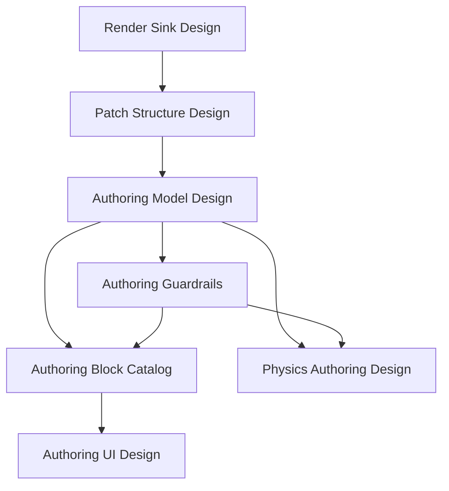

# Canonical Implementation Roadmap

This document orders the new `docs/WebGPU-Future/` design documents into the sequence they should be implemented.

It is the execution-order view over these docs:

- [1-CANONICAL-RENDER-SINK-DESIGN.md](./1-CANONICAL-RENDER-SINK-DESIGN.md)
- [3-CANONICAL-PATCH-STRUCTURE-DESIGN.md](./3-CANONICAL-PATCH-STRUCTURE-DESIGN.md)
- [4-CANONICAL-AUTHORING-MODEL-DESIGN.md](./4-CANONICAL-AUTHORING-MODEL-DESIGN.md)
- [5-CANONICAL-AUTHORING-GUARDRAILS.md](./5-CANONICAL-AUTHORING-GUARDRAILS.md)
- [6-CANONICAL-AUTHORING-BLOCK-CATALOG.md](./6-CANONICAL-AUTHORING-BLOCK-CATALOG.md)
- [7-CANONICAL-AUTHORING-UI-DESIGN.md](./7-CANONICAL-AUTHORING-UI-DESIGN.md)
- [8-CANONICAL-PHYSICS-AUTHORING-DESIGN.md](./8-CANONICAL-PHYSICS-AUTHORING-DESIGN.md)

// [LAW:one-source-of-truth] This roadmap is the canonical implementation-order view for the new design stack. The individual docs define the architecture; this document defines the sequence.
// [LAW:verifiable-goals] Each phase below has a concrete exit condition so implementation can be judged complete or incomplete without guesswork.

## 1. Dependency Order

The docs have a strict dependency shape:

Interpretation:

- the render boundary must be correct before patch structure can be correct
- patch structure must be correct before the authoring model can be correct
- authoring guardrails must be fixed before the block catalog grows
- UI should follow the authoring model, not define it
- physics should extend the authoring model after the render-only authoring slice is proven

## 2. Implementation Order

The recommended implementation order is:

1. `1-CANONICAL-RENDER-SINK-DESIGN.md`
2. `3-CANONICAL-PATCH-STRUCTURE-DESIGN.md`
3. `4-CANONICAL-AUTHORING-MODEL-DESIGN.md`
4. `5-CANONICAL-AUTHORING-GUARDRAILS.md`
5. `6-CANONICAL-AUTHORING-BLOCK-CATALOG.md`
6. `7-CANONICAL-AUTHORING-UI-DESIGN.md`
7. `8-CANONICAL-PHYSICS-AUTHORING-DESIGN.md`

That is the order to implement the design, not necessarily the order to finish every product surface.

## 3. Phase Plan

## Phase 0: Freeze The Render Boundary

Primary doc:

- [1-CANONICAL-RENDER-SINK-DESIGN.md](./1-CANONICAL-RENDER-SINK-DESIGN.md)

Goal:

- lock the renderer-facing architecture before any new authoring system is implemented

Implement:

- `SceneRenderSink`
- `RenderPrimitive`
- `RenderView`
- `ExtractedScenePacket`
- `RenderPrepare`
- `DrawQueueBuilder`
- `PreparedRenderFrame`

Why first:

- if this boundary moves later, every authoring layer above it will churn

Done when:

- the team can point to one canonical scene-to-render contract
- no new authoring or renderer work is being designed around legacy sink-table-first assumptions

## Phase 1: Replace The Patch Root Model

Primary doc:

- [3-CANONICAL-PATCH-STRUCTURE-DESIGN.md](./3-CANONICAL-PATCH-STRUCTURE-DESIGN.md)

Goal:

- stop thinking of the patch as one flat graph at the render boundary

Implement:

- `PatchProgram`
- `ResourceLibrary`
- `ModulationGraph`
- `SceneDefinition`
- `OutputDefinition`

Why second:

- the patch root shape determines how every higher-level authoring feature is stored, serialized, and compiled

Done when:

- the new patch structure exists as canonical data model
- compilation targets those strata instead of discovering them implicitly from one flat graph

## Phase 2: Freeze The Authoring Model

Primary doc:

- [4-CANONICAL-AUTHORING-MODEL-DESIGN.md](./4-CANONICAL-AUTHORING-MODEL-DESIGN.md)

Supporting doc:

- [5-CANONICAL-AUTHORING-GUARDRAILS.md](./5-CANONICAL-AUTHORING-GUARDRAILS.md)

Goal:

- define the finite user-facing authoring vocabulary and lock the architectural rules before block proliferation starts

Implement:

- the 10 canonical authoring object kinds
- finite modulator role taxonomy
- `updateClass` semantics
- boundary validation rules from the guardrails doc

Why now:

- block catalog and UI work should not invent architecture

Done when:

- every new authoring proposal must fit an existing family or justify itself against the guardrails
- the compiler/editor can validate legal layer ownership and legal graph flows

## Phase 3: Build The Render-Only MVP Authoring Surface

Primary doc:

- [6-CANONICAL-AUTHORING-BLOCK-CATALOG.md](./6-CANONICAL-AUTHORING-BLOCK-CATALOG.md)

Supporting docs:

- [4-CANONICAL-AUTHORING-MODEL-DESIGN.md](./4-CANONICAL-AUTHORING-MODEL-DESIGN.md)
- [5-CANONICAL-AUTHORING-GUARDRAILS.md](./5-CANONICAL-AUTHORING-GUARDRAILS.md)

Goal:

- prove the architecture with the smallest usable authoring slice

Implement only the MVP subset:

- `GeometryResource(triangle)`
- `MaterialResource(flatColor)`
- `ViewTemplate(ortho2d)`
- `Const`
- `Time`
- `Sine`
- `Add`
- `Multiply`
- `Colorize`
- `TransformBindings`
- `MaterialBindings`
- `VisibilityBindings`
- `PrimitiveDefinition`
- `SingleEmitter`
- `RepeatEmitter`
- `ViewDefinition`
- `Scene`
- `Output`

Why before UI expansion:

- the MVP authoring surface needs to work in data/compilation first

Done when:

- one proof patch renders with modulated position, scale, color, and view zoom
- a second proof patch renders multiple instances via `RepeatEmitter`
- the path is `authoring -> RenderPrimitive[] + RenderView -> SceneRenderSink -> RenderPrepare -> DrawQueueBuilder -> render`

## Phase 4: Build The Authoring UI For The MVP

Primary doc:

- [7-CANONICAL-AUTHORING-UI-DESIGN.md](./7-CANONICAL-AUTHORING-UI-DESIGN.md)

Goal:

- expose the MVP authoring model in a UI that matches the architecture rather than hiding it behind one giant canvas

Implement first:

- resource library editors
- modulation workspace
- scene workspace
- output workspace
- right-hand binding/property inspector
- bottom preview/diagnostic tray

Explicitly defer:

- simulation workspace
- advanced topology builders
- rich library browsing

Why after the render-only MVP:

- the UI should sit on proven authoring semantics, not invent them

Done when:

- a user can construct the MVP proof patches without touching a generic renderer sink or hidden render transport concept

## Phase 5: Harden Guardrails

Primary doc:

- [5-CANONICAL-AUTHORING-GUARDRAILS.md](./5-CANONICAL-AUTHORING-GUARDRAILS.md)

Goal:

- make the architecture hard to accidentally violate

Implement:

- schema validation
- block-family validation
- legal-connection validation
- `updateClass` completeness validation
- forbidden-pattern tests
- UI/editor restrictions matching the authoring layers

Why here:

- once MVP flows exist, enforcement becomes practical and valuable

Done when:

- adding a sink-like block, hidden transport output, or renderer-leaking authoring type fails mechanically

## Phase 6: Add Simulation Authoring

Primary doc:

- [8-CANONICAL-PHYSICS-AUTHORING-DESIGN.md](./8-CANONICAL-PHYSICS-AUTHORING-DESIGN.md)

Supporting docs:

- [4-CANONICAL-AUTHORING-MODEL-DESIGN.md](./4-CANONICAL-AUTHORING-MODEL-DESIGN.md)
- [5-CANONICAL-AUTHORING-GUARDRAILS.md](./5-CANONICAL-AUTHORING-GUARDRAILS.md)

Goal:

- extend the same authoring system to simulation-driven animation compatible with `P6-1`

Implement in two slices:

### Slice 6A: Simulation MVP

- `PhysicsWorldResource`
- `BodyResource(particle)`
- `BodyEmitter`
- `ForceField`
- `Simulation`
- `SimulationToTransform.position`
- `PrimitiveEmitter` over `BodyDomainRef`

Done when:

- simulation-owned domains can drive visible primitives without any render-transport leakage

### Slice 6B: Constraint Systems

- `ConstraintResource(distance)`
- `ConstraintEmitter`
- constraint topology builders

Done when:

- a constraint-based simulation patch compiles to simulation banks/schedules and still feeds scene assembly through typed simulation domains

## Phase 7: Extend The UI For Simulation

Primary doc:

- [7-CANONICAL-AUTHORING-UI-DESIGN.md](./7-CANONICAL-AUTHORING-UI-DESIGN.md)

Supporting doc:

- [8-CANONICAL-PHYSICS-AUTHORING-DESIGN.md](./8-CANONICAL-PHYSICS-AUTHORING-DESIGN.md)

Goal:

- expose simulation authoring through dedicated tools rather than raw graph spaghetti

Implement:

- simulation workspace
- physics overview panel
- body emitter builders
- constraint topology builders
- collider panels
- simulation debug overlays

Done when:

- a user can build a simulation-driven animation through dedicated simulation tools and connect it into scene assembly without editing low-level solver structures

## 4. What To Delay

Delay these until after the render-only MVP is proven:

- full multi-family shape taxonomy authoring
- simulation UI
- text-specific authoring workflows
- advanced material families
- deep render-graph feature composition

// [LAW:no-mode-explosion] The architecture should be proven through one canonical render-only path before adding more families and modes.

## 5. Recommended First Shipping Milestone

The first milestone should include only:

- Phase 0
- Phase 1
- Phase 2
- Phase 3
- the MVP subset of Phase 4

That gives:

- canonical render boundary
- canonical patch root
- canonical authoring model
- canonical block catalog
- a usable UI for building simple animated scenes

without pulling physics or advanced feature work into the critical path.

## 6. Reference Table

| Order | Doc | Why It Exists | Implement In |
|---|---|---|---|
| 1 | [1-CANONICAL-RENDER-SINK-DESIGN.md](./1-CANONICAL-RENDER-SINK-DESIGN.md) | Defines the scene-to-render boundary | Phase 0 |
| 2 | [3-CANONICAL-PATCH-STRUCTURE-DESIGN.md](./3-CANONICAL-PATCH-STRUCTURE-DESIGN.md) | Defines patch strata aligned to the render pipeline | Phase 1 |
| 3 | [4-CANONICAL-AUTHORING-MODEL-DESIGN.md](./4-CANONICAL-AUTHORING-MODEL-DESIGN.md) | Defines the finite authoring vocabulary | Phase 2 |
| 4 | [5-CANONICAL-AUTHORING-GUARDRAILS.md](./5-CANONICAL-AUTHORING-GUARDRAILS.md) | Defines invariants, boundaries, and extension rules | Phase 2 and Phase 5 |
| 5 | [6-CANONICAL-AUTHORING-BLOCK-CATALOG.md](./6-CANONICAL-AUTHORING-BLOCK-CATALOG.md) | Defines the concrete MVP block set and legal graph shapes | Phase 3 |
| 6 | [7-CANONICAL-AUTHORING-UI-DESIGN.md](./7-CANONICAL-AUTHORING-UI-DESIGN.md) | Defines appropriate UI workspaces and workflows | Phase 4 and Phase 7 |
| 7 | [8-CANONICAL-PHYSICS-AUTHORING-DESIGN.md](./8-CANONICAL-PHYSICS-AUTHORING-DESIGN.md) | Extends the authoring system to simulation-driven animation | Phase 6 |

## 7. Bottom Line

Implement the stack in this order:

1. renderer boundary
2. patch structure
3. authoring model
4. guardrails
5. MVP block catalog
6. MVP authoring UI
7. physics extension
8. simulation UI

That sequence keeps the hard contracts stable, proves the architecture with the smallest render-only slice, and only then expands into simulation and richer authoring surfaces.
