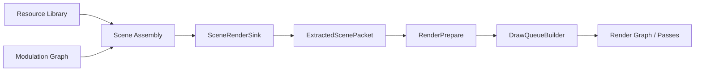
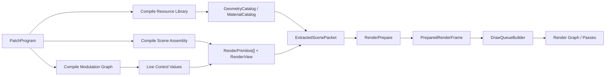

# Canonical Patch Structure Design

This document defines a new patch structure that is aligned with the clean-sheet render pipeline in [CANONICAL-RENDER-SINK-DESIGN.md](./CANONICAL-RENDER-SINK-DESIGN.md).

It is not a repair plan for the old patch graph. It is a new authoring model designed so user intent translates directly into the right renderer inputs.

// [LAW:one-source-of-truth] Patch structure should describe authoring intent once, then compile into render intent once. It must not duplicate renderer contracts as hidden patch-era side channels.
// [LAW:one-way-deps] Patch -> extracted scene -> prepared frame -> renderer. The renderer never pushes its ABI vocabulary back into the patch model.

## 1. Problem

The current patch model is too generic at the render boundary.

That creates two problems:

1. users author “patch wiring” instead of authoring scene intent
2. the engine has to rediscover scene/render semantics later from generic graph outputs

If the renderer wants:

- `RenderView`
- `RenderPrimitive[]`
- stable geometry/material catalogs
- per-frame instance/material parameters

then the patch model should produce those concepts directly.

The user goal is simple:

- users should be able to modulate everything in realtime

The engine goal is also simple:

- realtime modulation should land in the correct runtime bucket automatically
- static resource definitions should land in the correct static catalog automatically

## 2. Core Design

The new patch is not one undifferentiated graph.

It has four explicit authoring strata:

1. `Resource Library`
2. `Modulation Graph`
3. `Scene Assembly`
4. `Outputs`



// [LAW:dataflow-not-control-flow] This structure fixes stage order. Realtime variation lives in values flowing through `Modulation Graph` and `Scene Assembly`, not in special-case render branches.

## 3. Patch Root

The canonical patch document should look like this:

```ts
interface PatchProgram {
  resources: ResourceLibrary;
  modulation: ModulationGraph;
  scenes: readonly SceneDefinition[];
  outputs: readonly OutputDefinition[];
}
```

### Why This Root Shape

- `resources` maps to install-time renderer catalogs
- `modulation` maps to per-frame value production
- `scenes` maps to `RenderPrimitive[]`
- `outputs` maps to `SceneRenderSink`

This aligns directly with the renderer pipeline instead of forcing the compiler to infer those groups from one flat block soup.

## 4. Resource Library

`Resource Library` contains static definitions that become canonical install-time catalogs.

```ts
interface ResourceLibrary {
  geometries: readonly GeometryDefinition[];
  materials: readonly MaterialDefinition[];
  textures: readonly TextureDefinition[];
  viewTemplates: readonly ViewTemplateDefinition[];
}
```

### Resource Rules

`GeometryDefinition` owns:

- geometry family
- topology/template data
- static bounds
- geometry variant metadata

`MaterialDefinition` owns:

- shader/material family
- parameter schema
- blend/depth/cull policy
- texture/sampler references

`ViewTemplateDefinition` owns:

- projection mode
- clear policy
- default pass mask

The library is where “what exists” is declared. It is not where realtime animation happens.

// [LAW:one-source-of-truth] Geometry and material identity belong here, not in downstream modulation or queue stages.

## 5. Modulation Graph

`Modulation Graph` is the realtime authoring graph.

It contains:

- time
- audio
- input
- math
- envelopes
- noise
- state / feedback
- logic / triggers
- field generators

Its outputs are typed control values, not renderer packets.

```ts
type ModulationValue =
  | Scalar
  | Vec2
  | Vec3
  | Vec4
  | Color
  | Bool
  | Trigger
  | Field<T>;
```

### Important Boundary

The modulation graph does not produce:

- `DrawPacket`
- sink-table records
- backend handles
- GPU buffer offsets

It produces authoring-time control values that are consumed by scene assembly bindings.

## 6. Scene Assembly

`Scene Assembly` is the missing authoring seam.

This is where resources and modulation outputs combine into renderable scene intent.

It contains three main authoring object types:

1. `PrimitiveDefinition`
2. `PrimitiveEmitter`
3. `ViewDefinition`

### 6.1 Primitive Definition

`PrimitiveDefinition` declares the structure of a renderable thing.

```ts
interface PrimitiveDefinition {
  geometry: GeometryRef;
  material: MaterialRef;
  transformBindings: TransformBindingSet;
  materialBindings: MaterialBindingSet;
  visibilityBindings: VisibilityBindingSet;
}
```

This is not yet a live render primitive. It is a template that says:

- which geometry family is used
- which material family is used
- which properties are modulated
- which properties are constant

### 6.2 Primitive Emitter

`PrimitiveEmitter` produces live `RenderPrimitive[]`.

```ts
interface PrimitiveEmitter {
  primitive: PrimitiveDefinitionRef;
  instanceSource: InstanceSource;
  bindingValues: BindingValueMap;
}
```

The emitter is where users say:

- emit one thing
- emit N things
- emit over a field/domain
- emit instances from particles / curve samples / text glyphs / history

`PrimitiveEmitter` is the authoring-side origin of `RenderPrimitive[]`.

### 6.3 View Definition

`ViewDefinition` produces `RenderView`.

```ts
interface ViewDefinition {
  template: ViewTemplateRef;
  cameraBindings: CameraBindingSet;
}
```

This is where zoom, pan, projection params, pass mask, and other view-level modulation live.

## 7. Outputs

Outputs are intentionally tiny.

```ts
interface OutputDefinition {
  scene: SceneDefinitionRef;
  view: ViewDefinitionRef;
}
```

That compiles directly to:

```ts
interface SceneRenderSink {
  view: RenderView;
  primitives: readonly RenderPrimitive[];
}
```

The sink should not be where scene composition happens. By the time data reaches outputs, composition is already done.

## 8. Canonical Realtime Binding Model

The key to “modulate everything in realtime” is to classify each bindable property by ownership.

Every bindable property in `Scene Assembly` must declare one of these update classes:

1. `static`
2. `variant`
3. `view`
4. `instance`

```ts
type UpdateClass =
  | 'static'
  | 'variant'
  | 'view'
  | 'instance';
```

### `static`

Belongs to install-time catalogs.

Examples:

- base topology family
- material shader family
- parameter schema

Changing it rebuilds or swaps a catalog resource.

### `variant`

Selects among predeclared resource definitions.

Examples:

- switch triangle -> square
- switch flat material -> matcap material
- switch orthographic view template -> perspective template

This lets users modulate resource identity without exposing renderer internals.

### `view`

Updates the live `RenderView`.

Examples:

- zoom
- pan
- camera transform
- exposure
- pass enable/disable

### `instance`

Updates live `RenderPrimitive` values.

Examples:

- position
- rotation
- scale
- color
- thickness
- opacity
- curve control points
- per-instance visibility

// [LAW:single-enforcer] Scene assembly is the one boundary that classifies a property into `static`, `variant`, `view`, or `instance`. Lower layers consume that classification instead of re-deriving it.

## 9. What Users Actually Author

Users should author these things directly:

### Resources

- shapes / geometry families
- materials
- textures
- view templates

### Modulators

- oscillators
- noise
- envelopes
- sequencers
- input/audio reactivity
- math/logic combinations

### Assemblies

- transforms
- material param sets
- primitive definitions
- emitters / instancers
- views

### Outputs

- scene to view routing

This is a much better authoring mental model than “wire generic values into a render sink and hope the compiler recovers the right scene semantics later.”

## 10. Canonical Types Produced By The Patch

The patch compiler should lower authoring objects into exactly these high-level contracts:

```ts
interface CompiledPatchAuthoring {
  geometryCatalog: GeometryCatalog;
  materialCatalog: MaterialCatalog;
  scenes: readonly CompiledScene[];
  views: readonly CompiledView[];
}

interface CompiledScene {
  primitives: readonly RenderPrimitive[];
}

interface CompiledView {
  view: RenderView;
}
```

Then outputs pair a compiled scene and compiled view to produce `SceneRenderSink` inputs.

## 11. Example

A user wants:

- a circle geometry
- a neon material
- position driven by oscillator + mouse
- hue driven by audio
- scale driven by envelope
- one camera whose zoom is modulated by another oscillator

That patch should be expressed as:

```text
Resource Library
  - GeometryDefinition(circle)
  - MaterialDefinition(neon)
  - ViewTemplate(main2d)

Modulation Graph
  - oscX
  - mouseX
  - audioHue
  - scaleEnvelope
  - zoomOsc

Scene Assembly
  - PrimitiveDefinition(circle + neon)
  - TransformBinding(position.x = oscX + mouseX, scale = scaleEnvelope)
  - MaterialBinding(color.hue = audioHue)
  - PrimitiveEmitter(one instance)
  - ViewDefinition(main2d + zoomOsc)

Outputs
  - Output(scene = mainScene, view = mainView)
```

Under the hood that becomes:

- `GeometryCatalog(circle)`
- `MaterialCatalog(neon)`
- per-frame transform values
- per-frame material param values
- `RenderPrimitive[]`
- `RenderView`
- `SceneRenderSink`

## 12. Translation To Renderer Pipeline

The translation path should be explicit:



This makes the patch compiler’s job clear:

- compile resources to static catalogs
- compile modulation to live values
- compile assembly to scene/render packets

## 13. What Must Change Compared To The Current Patch Model

### Current bad shape

Today the patch graph is too flat and too late-bound at the render edge.

### New required shape

The patch must become structurally aware of:

- resource identity
- modulation values
- scene assembly
- outputs/views

That does not require abandoning graphs. It does require typed graph strata.

## 14. Forbidden Patch-Era Concepts

The new patch structure should forbid these concepts from becoming canonical:

1. A render sink whose public inputs are really backend packet fragments.
2. Hidden render outputs from authoring blocks.
3. Treating geometry, material, transform, and view as accidental compiler discoveries.
4. A flat patch graph with no distinction between resources, modulators, assemblies, and outputs.
5. Letting backend concepts like indirect strides or slot offsets leak into patch nodes.
6. Treating “modulate everything” as “all properties are the same kind of runtime data.”

## 15. Migration Strategy

### Phase 1

Define the new authoring contracts:

- `ResourceLibrary`
- `ModulationGraph`
- `PrimitiveDefinition`
- `PrimitiveEmitter`
- `ViewDefinition`
- `OutputDefinition`

### Phase 2

Add a compatibility lowering layer that maps current patch blocks into the new authoring strata.

Examples:

- current shape blocks -> `GeometryDefinition` or `PrimitiveDefinition`
- current color/transform wiring -> `MaterialBindingSet` / `TransformBindingSet`
- current sink blocks -> `OutputDefinition`

### Phase 3

Move compiler lowering to target the new authoring contracts first, then the render pipeline.

### Phase 4

Delete render-boundary assumptions from the generic patch graph.

## 16. Concrete Follow-Up Tickets

1. Define `PatchProgram`, `ResourceLibrary`, `ModulationGraph`, `SceneDefinition`, and `OutputDefinition` contracts.
2. Define `PrimitiveDefinition`, `PrimitiveEmitter`, `ViewDefinition`, and explicit binding-set types.
3. Add `UpdateClass` metadata to every bindable scene/view property and enforce it in compilation.
4. Design an HCL/DSL syntax for resources, modulation, assembly, and outputs that remains ergonomic in the editor.
5. Build a compatibility mapper from current flat patch blocks into the new authoring strata.
6. Change render compilation to target `RenderPrimitive[]` and `RenderView` from scene assembly outputs.
7. Remove hidden render-output concepts from authoring once the new pipeline is live.

## 17. Bottom Line

The new patch structure should describe:

- what resources exist
- what values change in realtime
- how those values bind onto scene primitives and views
- which scene is rendered to which output

It should not describe renderer transport details.

That is how users get “modulate everything in realtime” while the engine still produces the right renderer-facing data automatically.
