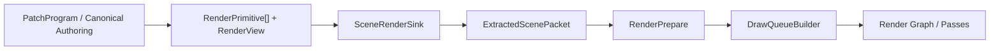
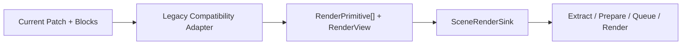

# WebGPU Future

This directory defines the canonical architecture and migration plan for the work that comes after the first visible WebGPU triangle.

The first triangle in the app is an important proof point: the renderer can now put a minimal primitive on screen through the new path. What is still missing is compatibility for the rest of the application. The remaining job is to make authoring, patch structure, UI, and simulation feed the same canonical render boundary instead of growing new renderer-shaped seams.

// [LAW:one-source-of-truth] This directory defines one canonical target stack for post-triangle application compatibility. The render boundary, authoring model, guardrails, and roadmap all converge on the same architecture.
// [LAW:verifiable-goals] Progress is concrete: existing patches and new authoring flows must compile into `RenderPrimitive[] + RenderView`, pass through `SceneRenderSink`, and render through the canonical prepare/queue path.

## 1. Current Status

What is proven now:

- one visible primitive can render in the app
- the canonical path is real enough to support a first proof geometry/material/view slice
- the repo has a concrete basis for building the rest of the application on top of the new renderer

What is not proven yet:

- existing patches broadly rendering through the canonical path
- animation/modulation compatibility
- repeated-instance compatibility
- canonical patch structure above the render boundary
- canonical authoring UI above the same model
- simulation/physics integration

The work in this directory is therefore no longer just "future thinking." It is the design stack for making the rest of the app compatible with the new renderer.

## 2. Canonical Target

The target architecture across these docs is:

This boundary is already the center of the design:

- authoring produces scene intent, not backend transport
- `SceneRenderSink` is the canonical scene-to-render boundary
- extraction, prepare, queue, and render stay below that boundary
- geometry/material catalogs remain canonical static authority

// [LAW:one-way-deps] Authoring flows downward into canonical scene submission, then into prepared renderer packets. Backend ABI details do not flow back upward into patch or UI design.

## 3. Compatibility During Migration

The current patch/block system is still relevant, but only as a temporary upstream frontend:

That compatibility seam is intentionally bounded:

- it is one adapter layer, not a second renderer architecture
- it translates legacy patch semantics into canonical scene submission
- it does not emit sink-table rows, slot layouts, or backend packets
- it is deleted once the new patch structure and authoring model are proven

// [LAW:single-enforcer] Legacy-to-canonical translation belongs in one compatibility adapter boundary, not in sink code, packers, and render passes.
// [LAW:no-mode-explosion] Compatibility is temporary and isolated to one layer with explicit removal criteria.

## 4. What This Directory Now Covers

These files form one coherent stack:

| File | Purpose |
|---|---|
| [1-CANONICAL-RENDER-SINK-DESIGN.md](./1-CANONICAL-RENDER-SINK-DESIGN.md) | Defines the canonical scene-to-render contract: `RenderPrimitive`, `RenderView`, `SceneRenderSink`, extraction, prepare, and queue boundaries. |
| [2-COMPATIBILITY-MIGRATION-PLAN.md](./2-COMPATIBILITY-MIGRATION-PLAN.md) | Defines how the current patch/block system temporarily feeds that canonical boundary without becoming permanent architecture. |
| [3-CANONICAL-PATCH-STRUCTURE-DESIGN.md](./3-CANONICAL-PATCH-STRUCTURE-DESIGN.md) | Defines the new patch root and the four canonical authoring strata: resources, modulation, scene assembly, and outputs. |
| [4-CANONICAL-AUTHORING-MODEL-DESIGN.md](./4-CANONICAL-AUTHORING-MODEL-DESIGN.md) | Defines the finite user-facing authoring vocabulary that sits on top of the patch structure. |
| [5-CANONICAL-AUTHORING-GUARDRAILS.md](./5-CANONICAL-AUTHORING-GUARDRAILS.md) | Defines the invariants and enforcement rules that keep the new authoring model from regressing into render-shaped graph soup. |
| [6-CANONICAL-AUTHORING-BLOCK-CATALOG.md](./6-CANONICAL-AUTHORING-BLOCK-CATALOG.md) | Defines the MVP block set needed to prove the render-only authoring slice, starting with triangle geometry and flat-color material. |
| [7-CANONICAL-AUTHORING-UI-DESIGN.md](./7-CANONICAL-AUTHORING-UI-DESIGN.md) | Defines the editor structure that matches the canonical layers instead of collapsing everything into one graph canvas. |
| [8-CANONICAL-PHYSICS-AUTHORING-DESIGN.md](./8-CANONICAL-PHYSICS-AUTHORING-DESIGN.md) | Extends the same authoring model to simulation-driven animation without introducing a second top-level architecture. |
| [9-CANONICAL-IMPLEMENTATION-ROADMAP.md](./9-CANONICAL-IMPLEMENTATION-ROADMAP.md) | Defines dependency order, implementation order, and shipping phases across the full stack. |
| [10-IMPLEMENTATION-PROOF-MATRIX.md](./10-IMPLEMENTATION-PROOF-MATRIX.md) | Defines the capability claims, required evidence, artifact expectations, and replay obligations for the unattended `FUTURE-*` loop. |

## 5. Execution Order After The First Triangle

The first triangle is the earliest render proof, not the end state.

The remaining directory-defined order is:

1. finish freezing the canonical render boundary around `SceneRenderSink`
2. build one legacy compatibility adapter from current patches into `RenderPrimitive[] + RenderView`
3. prove real existing patches through the canonical path: one visible primitive, one animated primitive, and one repeated-instance patch
4. introduce the canonical patch root above that same boundary
5. freeze the canonical authoring model and guardrails
6. prove the MVP authoring surface and block catalog
7. build the MVP authoring UI
8. extend into simulation/physics on the same architecture

// [LAW:dataflow-not-control-flow] The implementation order follows stable stage ownership: render boundary first, then translation, then authoring structure above it. New behavior should enter by changing data contracts, not by adding more special-case execution paths.

## 6. Immediate Design Rules

When using these docs to guide work, the practical rules are:

- all roads lead to `RenderPrimitive[] + RenderView -> SceneRenderSink`
- authoring may define resources, modulators, bindings, scenes, and outputs
- authoring may not define sink-table rows, slot IDs, indirect packets, or backend bindings
- UI must reflect the actual authoring seams: resources, modulation, simulation, scene, output
- physics extends the same architecture; it is not a parallel top-level system

Avoid:

- creating a second render boundary
- extending legacy hidden sink semantics as if they are canonical
- adding renderer transport concepts to authoring blocks
- letting compatibility code become the place where new features land first

## 7. Recommended First Shipping Milestone

The current design stack points to one focused first shipping milestone:

- canonical render boundary
- canonical patch structure
- canonical authoring model
- canonical guardrails
- MVP block catalog
- MVP authoring UI

That milestone should prove:

- one canonical render boundary
- one temporary compatibility seam for legacy patches
- one render-only MVP authoring slice built on triangle geometry, flat color, and an orthographic view

Simulation, richer shape families, advanced materials, and deeper render-graph composition should come after that slice is stable.

## 8. Bottom Line

This directory now defines how Oscilla moves from "a first triangle renders" to "the rest of the application is compatible with the canonical renderer."

The core idea is simple:

- freeze one render boundary
- translate legacy patches into it temporarily
- build the new patch and authoring model above it
- keep UI and physics aligned to the same architecture
- delete compatibility once the new path is proven

## 9. Unattended Loop

The implementation backlog for this roadmap now has a dedicated unattended two-agent loop:

- [docs/WebGPU-Future-Agent-Loop.md](../WebGPU-Future-Agent-Loop.md)
- [PROMPT-WEBGPU-FUTURE-PROGRESS.md](../../PROMPT-WEBGPU-FUTURE-PROGRESS.md)
- [PROMPT-WEBGPU-FUTURE-EVALUATOR.md](../../PROMPT-WEBGPU-FUTURE-EVALUATOR.md)
- [10-IMPLEMENTATION-PROOF-MATRIX.md](./10-IMPLEMENTATION-PROOF-MATRIX.md)

That loop is intended to run against the `FUTURE-*` implementation tickets and uses `session-docs/WEBGPU-FUTURE-LOOP.md` as the run-to-run handoff artifact.

`// [LAW:one-source-of-truth] The proof matrix is the single capability/evidence authority for unattended verification; loop docs and ticket bodies should reference proof IDs from it rather than duplicate verifier mechanics.`
