# WebGPU Future

This directory captures the **non-immediate** renderer architecture direction beyond `docs/WebGPU-Complete/`.

`docs/WebGPU-Complete/` remains the concrete near-term target for getting the current codebase back to a working WebGPU renderer. This directory exists to document the larger architectural direction so we do not accidentally treat the current WebGPU spec as the final renderer architecture.

// [LAW:one-source-of-truth] `docs/WebGPU-Complete/` remains the canonical near-term WebGPU completion source; this directory extends the architectural horizon without redefining current delivery gates.
// [LAW:verifiable-goals] Immediate success remains concrete and machine-checkable: the app boots, compiles, hot-swaps, and renders again through the WebGPU spec path.

## Purpose

- Preserve the distinction between:
  - what must be finished now (`current code -> WebGPU-Complete`)
  - what the renderer architecture should grow toward after that work is stable
- Provide a semantic framing that is broader than the current WebGPU spec
- Reduce scattershot rewrites by thinking in terms of graph transformation and stable stage boundaries

## Scope Guard

This directory is intentionally **not** a replacement for `docs/WebGPU-Complete/`.

- Use `docs/WebGPU-Complete/` for immediate implementation and readiness criteria
- Use `docs/WebGPU-Future/` for longer-horizon architectural thinking
- Do not block near-term WebGPU completion on ideas documented here unless they are explicitly pulled into `docs/WebGPU-Complete/`

// [LAW:no-mode-explosion] Future architecture ideas must not become ad-hoc parallel execution criteria that stall the current migration.

## Three-Graph Framing

We should think in terms of three graphs, not one:

1. `G0`: current implementation graph
2. `G1`: current WebGPU spec graph (`docs/WebGPU-Complete/`)
3. `G2`: longer-horizon renderer architecture graph

`G1` is a deliberate stepping stone. It narrows scope so the renderer can become operational again. `G2` is the broader semantic architecture we want to eventually approach once the WebGPU path is stable.

## Canonical Semantic Stage Graph

The most useful future-facing abstraction is a semantic stage graph that is broader than the current WebGPU spec:

```mermaid
flowchart LR
  A["Authoring Graph"] --> B["Compile"]
  B --> C["Extract Frame Data"]
  C --> D["Build Frame Inputs"]
  D --> E["Simulate"]
  E --> F["Visibility / Culling"]
  F --> G["Instance Assembly"]
  G --> H["Build Draw Commands"]
  H --> I["Render Graph Compile"]
  I --> J["Opaque Render"]
  J --> K["Transparent Render"]
  K --> L["Post / Composite / UI"]
  L --> M["Observe / Readback"]
  M --> N["Present"]
  N --> O["Publish History"]
```



// [LAW:dataflow-not-control-flow] This graph describes stable dataflow stages; variability should live in contracts and payloads, not in ad-hoc stage skipping.

This is not a promise that every one of these stages must exist today as separate modules. It is a semantic vocabulary for reasoning about where the renderer should eventually go.

## How The Three Graphs Relate

### `G0`: Current Code

Today the code is closest to:

```text
Compile
-> Install
-> InputMarshal
-> Simulate
-> RenderPrep
-> DrawPrep
-> Render
-> Observe
-> Swap
```

Important characteristics of the current implementation:

- install-time CPU materialization and packing still carry runtime meaning
- geometry is realized into vertex/index buffers during install
- a concrete `RenderPrep` seam exists in code even though it is not fully surfaced in the WebGPU spec
- worker hot path is already a useful deterministic stage pipeline

### `G1`: WebGPU-Complete

The current WebGPU spec is intentionally narrower:

```text
Compile
-> Install
-> InputMarshal
-> Simulate
-> DrawPrep
-> Render
-> Observe
-> Swap
```

This is a strong intermediate because it gives us a working, canonical frame order and clear ABI ownership. It is not yet a full renderer architecture.

### `G2`: Future Architecture

The longer-horizon architecture should move upward from execution-order docs toward:

- semantic extraction boundaries
- explicit resource classes
- pass/resource graph compilation
- feature composition
- backend implementation details pushed lower in the stack

## Where WebGPU-Complete Stops Short

The current WebGPU spec is directionally correct, but it intentionally stops short of a more mature renderer architecture in several ways:

1. It is primarily a **frame-stage execution spec**, not yet a full render-graph architecture.
2. Backend ABI details still sit close to the top-level architecture surface.
3. Extraction and packetization boundaries are only partially explicit.
4. Resource classes are narrower than in mature frame-graph systems.
5. One backend realization risks being mistaken for the architecture itself.
6. Feature composition is under-modeled compared to engines that routinely integrate shadows, post, UI, temporal history, and debug visualization through one graph.

## Comparison With More Mature Designs

Relative to experienced production designs such as Filament FrameGraph, Unreal RDG, and AMD RPS, the future direction should eventually shift toward:

### 1. Declarative pass/resource graphs

Mature renderers define passes and resources, then derive:

- execution order
- resource lifetime
- aliasing opportunities
- synchronization/barriers
- debug graph introspection

`docs/WebGPU-Complete/` mostly hardcodes canonical order because that is the right simplification for the current migration.

### 2. First-class resource taxonomy

Future architecture should distinguish:

- persistent scene resources
- transient frame resources
- history resources
- imported external resources
- presentation resources

The current WebGPU spec strongly defines Arena, ShapeBank, and Indirect Buffer, but not yet as a generalized resource system.

### 3. Explicit extraction boundary

Mature engines typically separate:

- authoring or simulation graph
- extracted frame packets
- renderer execution graph

Our current code already contains proto-extraction at install time. Future architecture should make that boundary explicit rather than hiding it inside packing/materialization helpers.

### 4. Backend details below semantic stages

Indirect stride, sink-table packing, header layout, and similar ABI rules are important, but future architecture should treat them as implementation of a lower layer rather than the highest-level architectural story.

### 5. Feature composition as graph contribution

Longer-term architecture should be able to add or remove:

- transparency
- text
- debug overlays
- post-processing
- temporal history
- picking
- readback

by contributing nodes/resources to the same graph, not by growing a monolithic linear loop.

## Architectural Posture

The practical rule is:

- use `WebGPU-Complete` to get rendering working again
- keep the future architecture in mind so we do not fossilize temporary seams into permanent design

That means we should prefer refactors that make the current system **more graph-like and more legible**, even when the immediate goal is still just to finish the WebGPU migration.

## Migration Strategy: Graph Transformation, Not Wholesale Replacement

The most promising migration pattern is to treat the path from `G0` to `G1` and eventually `G2` as graph transformation:

- `normalize`: rename and expose the stage boundaries that already exist
- `split`: separate mixed responsibilities into explicit seams
- `merge`: combine duplicate ownership into one authoritative node
- `move-edge`: reassign data ownership to the correct stage
- `replace`: keep a node contract stable and swap its internals
- `delete`: remove compatibility nodes only after their edges are gone

// [LAW:single-enforcer] Cross-cutting ownership should migrate by moving an enforcement boundary, not by layering duplicate checks and duplicate representations across old and new paths.
// [LAW:locality-or-seam] Each rewrite should operate at one seam so unrelated modules do not need to change in lockstep.

This is preferable to a scattershot "replace the core" approach because it keeps the unit of change small and verifiable.

## Immediate Focus Policy

The current priority remains:

```text
current implementation -> WebGPU-Complete
```

Specifically:

- recover a working render path
- keep compile/hot-swap/runtime invariants intact
- finish the canonical WebGPU path before broadening architecture scope

Future architecture notes should inform naming, boundaries, and sequencing, but they should not broaden the active delivery target right now.

## Practical Rule For Future Work

When working on the current WebGPU migration, prefer changes that do at least one of these:

- make an existing stage boundary explicit
- remove duplicate ownership of a concept
- rename a module so it matches the semantic graph
- convert hidden data transformations into named contracts
- preserve a replaceable node seam for later work

Avoid changes that do this:

- introduce a second competing architecture source for current delivery
- expand the active migration target to include speculative future features
- fuse temporary implementation shortcuts into permanent top-level abstractions

## Related Documents

- `docs/WebGPU-Complete/README.md`
- `docs/WebGPU-Complete/IMPLEMENTATION-INDEX.md`
- `docs/WebGPU-Complete/workstreams/WS-03-frame-execution.index.md`
- `docs/WebGPU-Complete/P0-0__Overview_-_GPU-Native_Visual_Instrument_Architecture.md`

